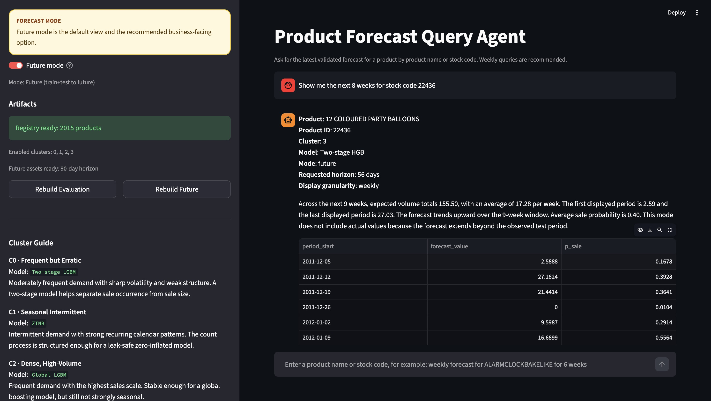

# Online_Retail_Forecasting

This project builds cluster-based forecasting models for online retail products and provides a Streamlit agent for product-level forecast lookup.

## Environment Setup

Create and activate the conda environment from `environment.yml`:

```bash
cd Online_Retail_Forecasting
conda env create -f environment.yml
conda activate forecasting-retail
```

If the environment already exists:

```bash
conda env update -f environment.yml --prune
conda activate forecasting-retail
```

## Start The Agent

1. Build the validated forecast artifacts (We have already built it, you don't need to run this):

```bash
python -m agent.build_assets --include-future
```

2. Launch the Streamlit app:

```bash
python -m streamlit run agent/app.py
```

3. Open the local URL shown in the terminal, usually `http://localhost:8501`.

## How To Use The Agent



The agent supports two modes:

- `Future mode`:
  Uses `train + test` history to forecast beyond the test period.
  This is the default and recommended business-facing mode.
- `Evaluation mode`:
  Reproduces the test-period forecast, so the response can include `actual_value`.

Recommended workflow:

1. Open the app.
2. Keep `Future mode` on unless you specifically want backtest results.
3. Enter a product name or stock code in the chat box.
4. Ask for weekly forecasts when possible, because weekly queries are the clearest way to present these models.

Example queries:

```text
Give me a weekly forecast for 12 PENCIL SMALL TUBE WOODLAND for 6 weeks
```
```text
Show me the next 8 weeks for stock code 20973
```

The app returns:
- matched product name and product ID
- cluster assignment
- production model used for that cluster
- forecast table
- forecast chart

## Cluster Routing

The agent does not let the LLM choose the model. Routing is fixed by cluster:

- `C0`: Two-stage LGBM
- `C1`: ZINB
- `C2`: Global LGBM
- `C3`: Two-stage HGB
